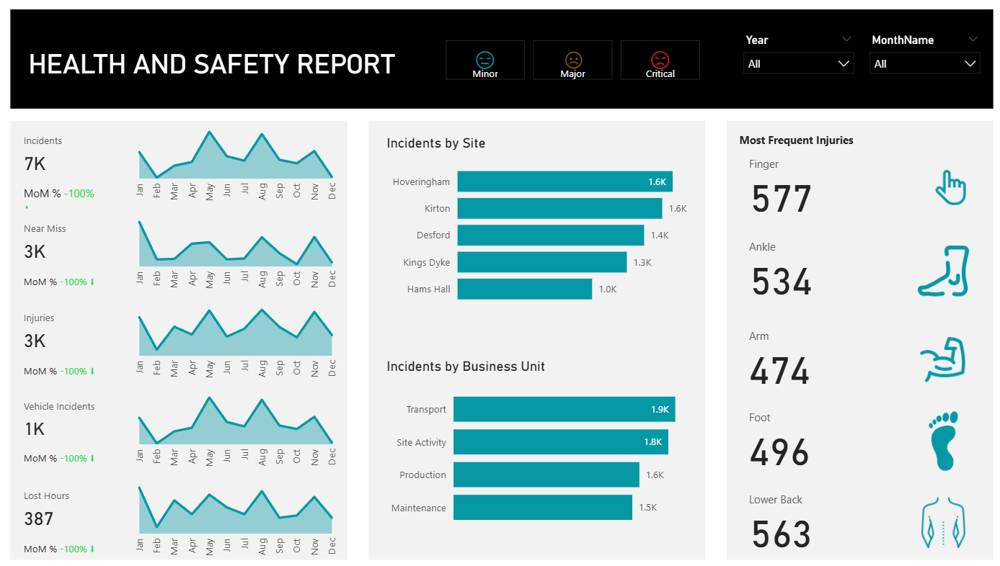
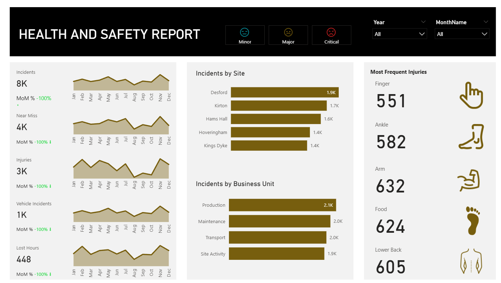
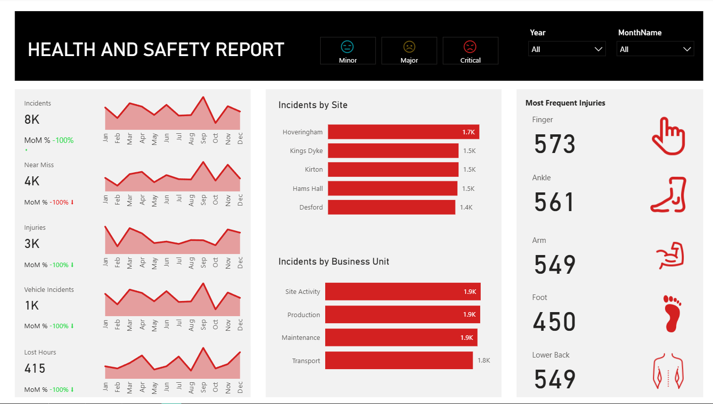
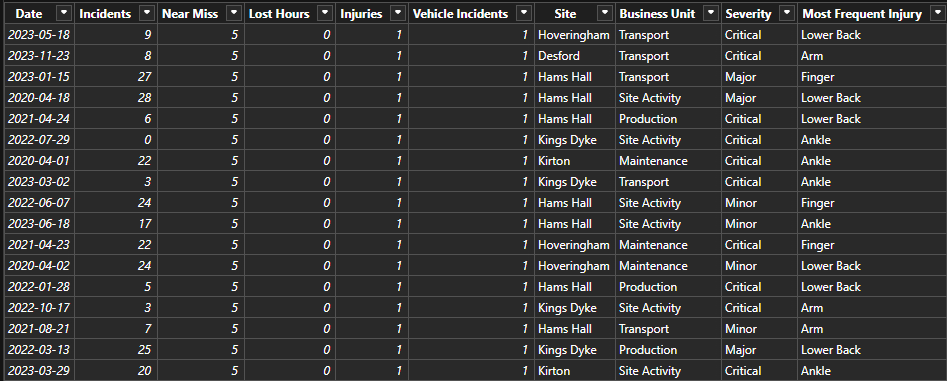
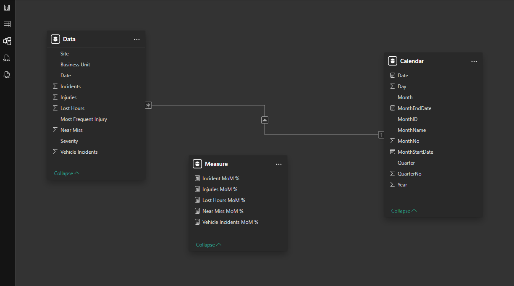

# 🛡️ HSE Monitor Dashboard

A **Health, Safety & Environment (HSE)** analytics dashboard built in **PowerBI** to track, analyze, and visualize workplace incidents, injuries, and near misses. This dashboard equips safety managers and stakeholders with actionable insights to monitor safety performance across sites and business units. 

---

## 📝 Project Overview

Workplace safety is critical for any organization. This dashboard provides a consolidated view of **incident severity, trends, and high-risk areas**. It enables users to:

* Track key safety metrics (incidents, near misses, injuries, vehicle incidents, lost hours).
* Analyze incidents by **site, business unit, and injury type**.
* Identify yearly trends and monthly variations.
* Support data-driven decision-making for **safety interventions and resource allocation**.

---

## 📊 Dashboards

## Minor Incidents

## Major Incidents

## Critical Incidents

---

## ⚡ Features & Functionality

### 📄 Severity-Based Pages

* **Minor Incidents ⚠️**
* **Major Incidents 🔴**
* **Critical Incidents 🛑**

Each page includes:

* **Interactive filters** for year & month 🗓️
* **Key Metrics & KPIs**:

  * Total Incidents 🛑
  * Near Misses ⚠️
  * Injuries 🤕
  * Vehicle Incidents 🚗
  * Lost Hours ⏳
  * Month-over-Month % Change 🔄
* **Detailed Breakdown**:

  * Incidents by Site 🏭
  * Incidents by Business Unit
  * Injuries by Type: Finger ✋, Ankle 🦶, Arm 💪, Foot 🦵, Lower Back 🧍‍♂️
* **Yearly Trend Analysis**: Line graph of incidents, injuries, near misses, vehicle incidents, and lost hours across all months (unaffected by filters).

---

## 📂 Dataset Summary

The data was sourced from organizational **HSE records** and includes:

* **Incidents**: Reported workplace events
* **Near Misses**: Potential harmful events that did not result in injury
* **Lost Hours**: Time lost due to injuries
* **Injuries by Type**: Finger, ankle, arm, foot, lower back, etc.
* **Vehicle Incidents**: Safety-related vehicle events
* **Site & Business Unit**: Location & organizational categorization
* **Severity**: Categorized as Minor, Major, or Critical

**Sample Dataset Preview:**

---

## 🔍 Analytical Approach

1. **Data Preprocessing**: Cleaned and standardized in Excel/CSV.
2. **ETL in PowerBI**: Loaded and transformed data for consistency.
2. **Data Modelling**: Developed Dimensional modelling by creating dimensions like `Calendar`
3. **Dashboard Design**: Built interactive dashboards with filters.
4. **Visualization**: Trends and breakdowns by severity, site, and injury type.
5. **Yearly Analysis**: Line charts for long-term trends, unaffected by month filters.

---

## 💡 Key Findings

* **Severity**: Major incidents contributed significantly to lost hours.
* **Site Variation**: Certain sites consistently showed higher incident rates.
* **Injury Types**: Lower back and finger injuries were most frequent.
* **Yearly Patterns**: In 2023, incidents rose steadily toward year-end compared to previous years.

---

## 📌 Business Recommendations

* **Site Interventions**: Prioritize training at high-incident sites.
* **Targeted Safety Programs**: Address recurring injuries (e.g., lower back, finger).
* **Monthly Safety Reviews**: Detect and mitigate risks early.
* **Resource Allocation**: Plan based on yearly trend analysis for high-risk months.

---

## ⚖️ Assumptions & Limitations

* **Data Quality**: Relies on accurate incident reporting.
* **External Factors**: Weather, workload, etc., not considered.
* **Trend Analysis**: Assumes consistent reporting across months.
* **Filter Scope**: Year/month filters allow single period selection only.

---

## 🛠️ Technologies Used

* **PowerBI 💻** – Dashboard creation & visualization
* **Excel / CSV 📊** – Data preprocessing

---

## 👩‍💻 Author

**Sanya** – *Data Engineer & Analyst*
