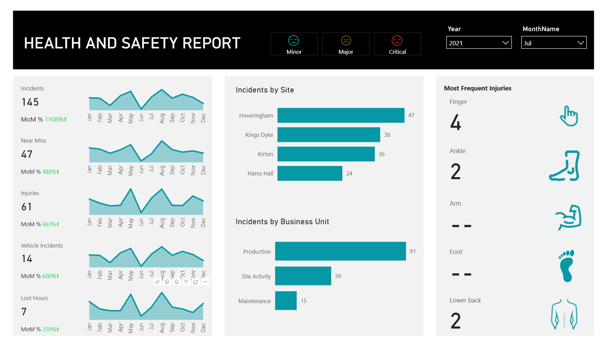
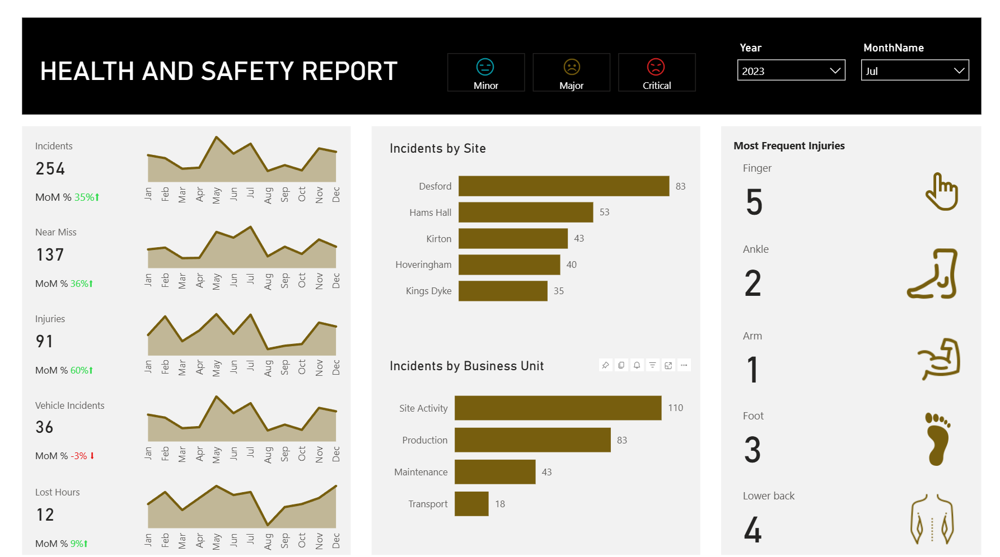
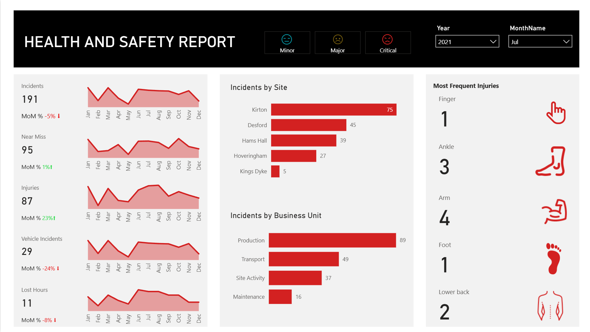

# HSE Monitor Dashboard

A comprehensive **Health, Safety & Environment (HSE) analytics dashboard** built in PowerBI to track, analyze, and visualize workplace incidents, injuries, and near misses. This dashboard provides actionable insights for safety performance monitoring at site and business unit levels.

## Project Overview

This dashboard is designed to help organizations understand safety trends, identify risk areas, and monitor incident severity across sites. Users can quickly view total incidents, near misses, injuries, vehicle incidents, and lost hours, as well as compare performance month-over-month.

## Dashboards

## Features

- **Severity-Based Pages**: Separate pages for **Minor, Major, and Critical** incidents.
- **Filters**: Select **one year** and **one month** to view filtered data per page.
- **Key Metrics**:
  - Total Incidents
  - Total Near Misses
  - Total Injuries
  - Total Vehicle Incidents
  - Total Lost Hours
  - Month-over-Month Percentage Change
- **Detailed Analysis**:
  - Incidents by **Site** and **Business Unit**
  - Total injuries by **type** (Finger, Ankle, Arm, Foot, Lower Back, etc.)
- **Yearly Trends**: Line graph showing **monthly totals** of incidents, injuries, near misses, vehicle incidents, and lost hours for the entire year (not affected by month filter).

## Dataset

The dataset includes:

| Date       | Incidents | Near Miss | Lost Hours | Injuries | Vehicle Incidents | Site         | Business Unit | Severity | Most Frequent Injury |
|------------|-----------|-----------|------------|----------|-----------------|--------------|---------------|---------|--------------------|
| 18-May-23  | 9         | 5         | 0          | 1        | 1               | Hoveringham  | Transport     | Critical | Lower Back         |

## Technologies

- **PowerBI** for dashboard creation and visualization
- **Excel / CSV** for data handling and preprocessing

## Insights

This dashboard enables stakeholders to:

- Track incident severity and trends over time  
- Identify high-risk sites or business units  
- Monitor the effectiveness of safety interventions  
- Compare monthly changes in incidents, injuries, and lost hours  

## Author

**Sanya**  Data Engineer & Analyst

